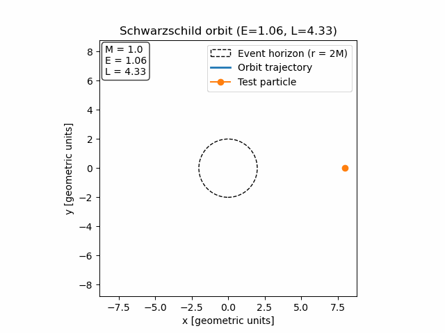

# Schwarzschild Orbit Simulation

Numerical simulation of test-particle orbits in **Schwarzschild spacetime** by integrating the geodesic equations in the equatorial plane.  
The project focuses on clean visualization of relativistic orbits (bound, unbound, plunge) and provides both static plots and animated trajectories.

---

## Physical Model

We consider a non-rotating, spherically symmetric black hole described by the Schwarzschild metric

$$
ds^2 = -\left(1-\frac{2M}{r}\right)dt^2
       + \left(1-\frac{2M}{r}\right)^{-1}dr^2
       + r^2 d\phi^2
$$

Motion is restricted to the equatorial plane $(\theta = \pi/2)$.  
Due to spacetime symmetries, the system admits two conserved quantities:

- **E** — energy per unit mass  
- **L** — angular momentum per unit mass  

The radial motion is governed by the effective potential $(V_{\text{eff}}(r))$, and the equations of motion are integrated numerically using proper time $(\tau)$.

All calculations are performed in **geometrized units** $(G = c = 1)$.

---

## Numerical Approach

- Second-order radial equation rewritten as a **first-order ODE system**
- Numerical integration using `scipy.integrate.solve_ivp`
- Automatic termination at the **event horizon** $(r = 2M)$
- Cartesian coordinates used for visualization
- Optional animation generated using `matplotlib.animation`

---

## Features

- Static orbit plots (bound, scattering, plunge)
- Visualization of the effective potential
- Event horizon highlighted at $(r = 2M)$
- **Animated GIFs**
- Clean Jupyter notebook structure

---

## Example Animation

Below is an example of a test-particle orbit in Schwarzschild spacetime.  
The dashed circle indicates the event horizon $(r = 2M).$

<p align="center">
  
</p>

---

## Repository Structure

```text
.
├── Orbit_Simulation_Schwarzschild_GithubReady.ipynb
├── figures/
│   └── orbit.gif
├── README.md
├── requirements.txt
└── LICENSE
